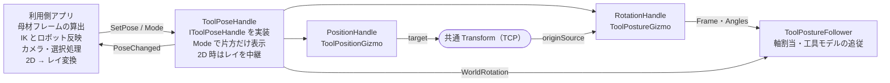

# ToolPoseHandle 利用側向け設計まとめ

2026-10-06

## 1. 概要

ToolPoseHandle は、工具（溶接トーチ）の位置と姿勢を実行中に画面上で掴んで編集するためのハンドル一式の入口である。位置ハンドルと姿勢ハンドルを 1 つずつ束ね、利用側には `IToolPoseHandle` という 1 つの口だけを見せる。

利用側は「どのハンドルが有効か」「どう掴むか」を知る必要がない。見るのは現在の姿勢 `Pose`、書き戻し用の `SetPose`、3 つのイベント（`DragBegan` / `PoseChanged` / `DragEnded`）である。

本書の呼称と実装上の型名は次のとおり対応する。

| 本書の呼称 | 実装クラス | モード指定 | イベントでの種別 |
| --- | --- | --- | --- |
| ToolPoseHandle | `ToolPoseHandle`（`IToolPoseHandle` を実装） | — | — |
| PositionHandle | `ToolPositionGizmo` | `HandleMode.Position` | `ToolHandleKind.Position` |
| RotationHandle | `ToolPostureGizmo` | `HandleMode.Posture` | `ToolHandleKind.Posture` |

責務の境界は次のとおり。右列は利用側プロジェクトで設計する。

| ハンドル側が持つ | 利用側が持つ |
| --- | --- |
| ハンドルの描画、当たり判定、ドラッグ計算 | 母材フレーム（L, M, N）の算出と供給 |
| 位置・フレーム・角度の保持と通知 | IK の求解とロボットへの反映 |
| 角度の可動範囲によるクランプ、スナップ | IK 失敗時の書き戻し方針 |
| 3D ビューでのポインタ読み取り | 2D 重畳ビューでの「画面座標 → レイ」変換 |
| 工具モデルの追従（`ToolPostureFollower`） | ドラッグ中のカメラ操作の抑止、自前の選択処理との優先順位 |

コードは 2 つのアセンブリに分かれる。姿勢の表現と変換は `ToolRuntimeGizmos.Core`、ハンドル本体は `ToolRuntimeGizmos.Runtime` にあり、名前空間は `ToolRuntimeGizmos.Core` / `.Gizmo` / `.Tool` である。入力は Unity Input System を前提とする。

## 2. ToolPoseHandle

ToolPoseHandle はシーンに 1 つ置く `MonoBehaviour` で、利用側が切り替えるのは `Mode`・`Visible`・`View` の 3 つだけである。姿勢の受け渡しは `IToolPoseHandle` 経由で行い、利用側のコードはこのインターフェースに依存させる。



位置ハンドルが共通 Transform を動かし、姿勢ハンドルがそこを原点にする。世界回転は Follower の軸割当を通して得る。

### 2.1 表示と操作の切り替え

| プロパティ | 型 / 値 | 動作 |
| --- | --- | --- |
| `Mode` | `HandleMode.Position` / `Posture`（既定 `Posture`） | 出すハンドルを選ぶ。同時に出るのは常に片方だけ |
| `Visible` | `bool`（既定 `true`） | `false` で両方消え、掴めなくなる |
| `View` | `ViewMode.View3D` / `View2D`（既定 `View3D`） | 3D はハンドルが自分でポインタを読む。2D は利用側が渡したレイで動く |
| `SizeScale` | `float`（既定 1） | 大きさ・線の太さ・当たり判定に一様に効く倍率 |
| `IsDragging` | `bool`（読み取り） | 何かを掴んでいる間 `true` |

モードや表示を切り替えたとき、消える側がドラッグ中ならそのドラッグは取り消され、値は掴む前に戻る。このとき `DragEnded` が `Cancelled = true` で届く。

### 2.2 姿勢の読み書き

| メンバー | 内容 |
| --- | --- |
| `ToolPose Pose` | 現在の姿勢。位置・母材フレーム・フレーム上の角度をまとめた値 |
| `void SetPose(ToolPose)` | 姿勢を与える。フレームと角度を同時に差し替える。イベントは発火しない |
| `Quaternion WorldRotation` | 工具の世界回転。軸割当は `ToolPostureFollower` が持つ |
| `void SetWorldRotation(Quaternion)` | 世界回転から角度を逆算して与える。イベントは発火しない |
| `Vector3 ToolAxisWorld` | 工具軸のワールド方向（TCP から工具本体へ向かう向き） |
| `Vector3 ToolReferenceWorld` | スピン適用後の工具基準方向。工具軸に直交する |
| `bool Raycast(Ray, out float)` | レイが表示中のハンドルに当たるかと、その距離 |

`ToolPose` は `Frame`（`WorkFrame`）と `Angles`（`ToolPostureAngles`）の 2 つを持つ読み取り専用の構造体である。位置はフレームの原点そのもので、別には持たない。部分的な差し替えには `WithPosition` / `WithFrame` / `WithAngles` を使う。

世界回転は `ToolPose` に含まれない。回転を組むには「モデルのどのローカル軸を工具軸に向けるか」が必要で、それは `ToolPostureFollower` の `shaftAxis` / `referenceAxis` が決める。座標系をまたいでロボットへ渡す場合は、クォータニオンより `ToolAxisWorld` と `ToolReferenceWorld` の 2 ベクトルで渡す方が安全である。

### 2.3 イベント

値の流れはハンドルから利用側への一方向が基本である。3 つとも引数は `ToolPoseEvent`（`Pose`・`Kind`・`Cancelled`）。

| イベント | 発火タイミング | 利用側でやること |
| --- | --- | --- |
| `DragBegan` | 掴んだ瞬間に 1 回 | Undo の記録、IK セッション開始、戻り先の初期値の保存 |
| `PoseChanged` | 値が変わるたび。ドラッグ中は毎フレーム | IK を解き、成功したときだけロボットを更新する |
| `DragEnded` | 離したとき、または取り消されたとき | 最後に成功した姿勢へ `SetPose` / `SetWorldRotation` で書き戻す |

`Kind` には動かしたハンドルの種類が入るので、位置と姿勢で処理を分けられる。`Cancelled` は `DragEnded` でだけ意味を持ち、`true` のとき `Pose` はドラッグ開始前の値に戻っている。

### 2.4 インスペクタ設定

| 項目 | 内容 |
| --- | --- |
| `positionGizmo` / `postureGizmo` | 束ねる 2 つのハンドル。必須 |
| `follower` | 世界回転の軸割当を持つ `ToolPostureFollower`。未設定ならシーンから探す |
| `mode` / `active` / `view` / `sizeScale` | 上記プロパティの初期値。実行中にインスペクタで変えても追従する |
| `rayProvider` | 2D 用。`IGizmoRayProvider` を実装したコンポーネントを持つ GameObject |

2 つのハンドルを同じ場所に出すには、共通の Transform を 1 つ用意し、`ToolPositionGizmo.target` と `ToolPostureGizmo.originSource` の両方へ差す。位置ハンドルがそれを動かし、姿勢ハンドルがそこを原点にするので、切り替えても場所がずれない。

## 3. PositionHandle（ToolPositionGizmo）

PositionHandle は 3 本の軸矢印を出し、掴んだ軸の方向への平行移動だけを行う。回転もスケールも扱わず、平面移動や自由移動のハンドルも持たない。

### 3.1 操作仕様

- 軸を掴んでドラッグすると、その軸の直線上だけを動く。移動量はレイと軸直線の最近接点で決まり、カメラの向きに依存しない。
- Ctrl を押しながらドラッグすると、移動量を `snapStep`（既定 0.01、ワールド単位）刻みに丸める。0 以下でスナップ無効。
- 掴んでいる間は、開始位置からの移動量が破線で表示され、他の軸は隠れる。
- ドラッグが取り消されると、位置は掴む前の値に戻る。
- 当たり判定は軸に沿ったカプセルで、視線が軸方向に寝ても掴み幅が変わらない。タッチ入力時は判定が広がる。

### 3.2 軸の向き

軸の向きは `GizmoAxisSpace` で決まる。母材フレームに沿って動かしたい場合は `Explicit` を使う。

| 値 | 軸の向き | 用途 |
| --- | --- | --- |
| `World`（既定） | ワールドの X / Y / Z | 絶対座標での位置決め |
| `Local` | ハンドルの GameObject のローカル軸 | 親の向きに追従させる |
| `Explicit` | `AxisRotation` に代入した回転 | 母材フレーム（L, M, N）やロボット座標に沿わせる |

`AxisRotation` へ代入すると自動的に `Explicit` へ切り替わる。母材フレームに合わせるときは `WorkFrame.Rotation` を渡せば、X = L、Y = N、Z = M になる。軸の色もこの対応でフレーム軸の色を流用している。

### 3.3 入出力と設定

| メンバー | 内容 |
| --- | --- |
| `Vector3 Position` | ハンドルが指す位置。代入すると `target` にも反映される |
| `Transform target` | 設定すると、この Transform の位置を読み書きする。ドラッグ外では外から動かされた分を毎フレーム取り込む |
| `showAxisX` / `showAxisY` / `showAxisZ` | 軸ごとの表示。隠した軸は掴めない。動かしてよい方向の制限に使える |
| `snapStep` | Ctrl スナップの刻み幅 |
| `PositionChanged` | 位置が変わったときのイベント |

ToolPoseHandle 経由で使う場合、利用側は `PositionChanged` を直接購読せず、`PoseChanged` を `Kind == ToolHandleKind.Position` で受ける。位置は `e.Pose.Position` で読める。

### 3.4 利用側での考慮点

位置を動かしても母材フレームの向きは変わらない。母材が曲面や折れ線で、位置によってフレームが変わる場合は、利用側が新しい位置でのフレームを求めて与え直す。ドラッグ中は値を書き戻せないので、`DragEnded` で `e.Pose.WithPosition(...).WithFrame(...)` を `SetPose` に渡す形になる。

デバッグ用に、実行中は数字キー 1 / 2 / 3 で X / Y / Z 軸の表示が切り替わる。製品に組み込むときは `useKeyboardShortcuts` を `false` にする。

## 4. RotationHandle（ToolPostureGizmo）

RotationHandle は、与えられた 1 つの母材フレーム（L, M, N）に対して、工具軸の向きと軸まわりの回転を決める。一般的な XYZ 3 軸の回転リングではなく、溶接角の定義に合わせた 3 つの角度を直接操作する点が特徴である。

### 4.1 基準フレームと角度の定義

角度はすべて母材フレーム `WorkFrame` の上で測る。M は進行方向（Feed）、N は面法線（Normal）、L はその両方に直交する方向（CrossFeed）である。工具軸は TCP から工具本体へ向かう向き、つまり母材から離れる向きで表す。

保持する角度は `ToolPostureAngles` の 3 つで、狙い角・進行角はそこからの導出値である。

| 角度 | フィールド | 定義（内部値） |
| --- | --- | --- |
| 旋回角 θ | `azimuthDeg` | LM 平面上の方位。L 軸正方向が 0°、M 方向が +90° |
| 仰角 φ | `elevationDeg` | LM 平面からの仰角。90° で工具軸が N に一致（垂直姿勢） |
| 傾斜角 α | `TiltFromNormalDeg` | N からの倒し量。α = 90° − φ |
| スピン | `spinAngleDeg` | 工具軸まわりの回転。0° の基準はプロファイルの `spinReference` |
| 狙い角 w / 進行角 t | `WorkAngleDeg` / `TravelAngleDeg` | AWS の投影角。読み書きできるが保持はしない |

### 4.2 ハンドル構成

4 つのハンドルが角度に 1 対 1 で対応する。`GizmoHandleId` は `SetAngleDisplay` で角度を指定するときにも使う。

| ハンドル | `GizmoHandleId` | 編集対象 | 形状 | 表示フラグ |
| --- | --- | --- | --- | --- |
| 傾斜円弧 | `TiltArc` | 傾斜角 α のみ | N と工具軸が張る平面上の円弧 | `showTiltArc` |
| 旋回リング | `AzimuthRing` | 旋回角 θ のみ | LM 平面（母材面）上のリング | `showAzimuthRing` |
| 軸先端 | `AxisTip` | θ と α を同時 | 工具軸の先端。球面上を直接ドラッグ | `showAxisTip` |
| スピンリング | `SpinRing` | スピンのみ | 工具軸に直交するリング | `showSpinRing` |

工具軸の矢印と LMN フレームの矢印（`showFrameAxes`）はハンドルとは別に描かれる。表示フラグを落としたハンドルは掴めないので、たとえばスピンを編集させない画面では `showSpinRing` を `false` にする。

### 4.3 可動範囲・スナップ・表示値

角度の決まりごとは `ToolPostureProfile` アセットにまとめ、`ToolPostureGizmo` の `profile` へ差す。未設定でも組み込み既定で動く。角度ごとに `AngleConvention` を 1 つ持ち、次を定める。

| 項目 | 内容 | 既定 |
| --- | --- | --- |
| `zeroOffsetDeg` / `invertDirection` | 表示上の 0° 位置と正方向 | 傾斜は仰角表示（φ = 90° − α） |
| `useLimits` / `minDeg` / `maxDeg` | 可動範囲。表示値で指定する | 傾斜は α = ±60°、旋回とスピンは無制限 |
| `snapDeg` | Ctrl ドラッグ時の刻み。表示値の刻みで丸める | 5° |

`Pose.Angles` で読めるのは内部値であり、画面に出す数値とは 0° 位置と向きが違うことがある。UI に表示するときは `Profile.tiltConvention.ToDisplay(...)` のように規約を通す。逆に数値入力欄から角度を与えるときは `SetAngleDisplay(GizmoHandleId, displayDeg)` を使うと、変換とクランプがまとめて行われる。

プロファイルは共有アセットなので、実行中に値を書き換えない。工程や開先形状ごとに範囲を変えたい場合は、アセットを複数作って `Profile` を差し替える。

### 4.4 入出力

| メンバー | 内容 |
| --- | --- |
| `WorkFrame Frame` | 姿勢が乗る母材フレーム。利用側が代入する |
| `Transform originSource` | 設定すると、フレームの向きはそのままに原点だけこの Transform に合わせる |
| `ToolPostureAngles Angles` | 現在の角度（内部値） |
| `SetSpherical` / `SetAngleDisplay` / `SetToolAxisWorld` | 角度を直接与える入口 |
| `ToolAxisWorld` / `ToolAxisLmn` | 工具軸のワールド方向 / LMN 成分 |
| `PostureChanged` | 角度が変わったときのイベント |

フレームはハンドル側では計算しない。溶接線や面から求めた結果を `WorkFrame.TryCreate`（進行方向と法線から）または `TryFromBasis`（L も分かっている場合）で作り、`Frame` へ代入する。代入が無い間は、ハンドルの Transform 位置に置いた既定フレーム（M = +Z、N = +Y）が使われる。

ToolPoseHandle 経由で使う場合は `PostureChanged` を直接購読せず、`PoseChanged` を `Kind == ToolHandleKind.Posture` で受ける。

### 4.5 垂直姿勢の扱い

工具軸が N に一致する垂直姿勢では、旋回角が幾何的に決まらない。ハンドルは旋回角を保持値として持ち続けるので、垂直を経由しても旋回角は失われず、垂直をまたぐドラッグでも 180° 飛ばない。

その代わり、同じ姿勢を表す角度の組が複数あり、仰角は 90° を超えた値を取りうる。角度を保存したり外部へ送ったりする前には `ToolPostureAngles.Normalize()` を呼び、φ を ±90°、θ を −180° 以上 180° 未満に収める。姿勢を世界回転で書き戻すときは `SetWorldRotation` を使えば、垂直姿勢でも旋回角が残る。

## 5. 組み込み手順

利用側の作業は「シーンに配線する」「フレームを供給する」「イベントを受けて IK に流す」の 3 つに分かれる。

1. **シーンに配線する。** TCP を表す共通の Transform を 1 つ置き、`ToolPositionGizmo.target` と `ToolPostureGizmo.originSource` に差す。`ToolPostureFollower` に工具モデルと `shaftAxis` / `referenceAxis` を設定する。`ToolPoseHandle` に 2 つのハンドルと Follower を差す。
2. **母材フレームと初期姿勢を与える。** 対象の継目が決まった時点で `WorkFrame` を作り、`SetPose` で位置・フレーム・角度をまとめて渡す。
3. **イベントを購読する。** `PoseChanged` で IK を解き、`DragEnded` で必要なら書き戻す。
4. **モード切り替えの UI をつなぐ。** ボタン等から `Mode` と `Visible` を設定する。
5. **カメラ操作と競合させない。** カメラ制御の入口で `RuntimeGizmo.AnyDragging` を見て、`true` の間はカメラを動かさない。
6. **自前の選択処理と優先順位をつける。** クリックで物を選ぶ処理があるなら、先に `handle.Raycast` を呼び、当たっていて手前なら自分の処理を飛ばす。
7. **2D 重畳ビューを使う場合のみ。** `ScreenToRay` に「画面座標 → ワールドのレイ」を差し、`View = View2D` にする。

イベント処理の雛形は次のとおり。IK が失敗したフレームではロボットを動かさず、離した時点で最後に成功した姿勢へハンドルを戻す。

```csharp
IToolPoseHandle handle;          // ToolPoseHandle をインターフェースで受ける
Vector3 goodPosition;
Quaternion goodRotation;

void Setup(WorkFrame frame)
{
    var angles = ToolPostureAngles.FromProjected(workDeg: 0f, travelDeg: 10f, spinDeg: 0f);
    handle.SetPose(new ToolPose(frame, angles));

    handle.DragBegan   += e => { goodPosition = e.Pose.Position; goodRotation = handle.WorldRotation; };
    handle.PoseChanged += OnPoseChanged;
    handle.DragEnded   += OnDragEnded;
}

void OnPoseChanged(ToolPoseEvent e)
{
    // 変わったのはハンドルの値だけ。ロボットはまだ動いていない
    if (!ik.TrySolve(e.Pose.Position, handle.WorldRotation)) return;

    robot.Apply();
    goodPosition = e.Pose.Position;
    goodRotation = handle.WorldRotation;
}

void OnDragEnded(ToolPoseEvent e)
{
    if (e.Cancelled) return;      // ハンドル側で開始前の値に戻っている

    if (e.Kind == ToolHandleKind.Position)
    {
        // 位置を戻し、その位置でのフレームに更新する。1 回で渡して中間状態を作らない
        ToolPose p = e.Pose.WithPosition(goodPosition);
        if (workpiece.TryGetFrameAt(goodPosition, out WorkFrame f)) p = p.WithFrame(f);
        handle.SetPose(p);
    }
    else
    {
        handle.SetWorldRotation(goodRotation);
    }
}
```

`ik`・`robot`・`workpiece` は利用側のクラスを表す仮の名前である。位置と姿勢で戻し方が違う点に注意する。位置を戻すときはフレームもその位置のものに更新し、姿勢を戻すときは角度だけを戻す。フレームを差し替えると角度はフレーム相対のまま保たれるので、工具の世界姿勢はフレームと一緒に回る。溶接角を継目基準に保つという意味で、これが意図した動作である。

ロボット座標系（右手系、ZYX オイラー角など）への変換が必要な場合は、Core アセンブリの `HandednessConversion` と `RobotPostureConvert` を使う。本書の範囲外なので詳細は省く。

## 6. 制約と注意点

利用側の設計で見落とすと不具合になる点を、原因と対処の組でまとめる。

| 制約 | 理由 | 利用側の対処 |
| --- | --- | --- |
| ドラッグ中に `SetPose` を呼ばない | ドラッグは掴んだ瞬間の基準から毎フレーム引き直すので、次のフレームで上書きされる | 書き戻しは `DragEnded` の中か、それ以降に行う |
| `SetPose` / `SetWorldRotation` はイベントを出さない | 書き戻しが次の IK を呼ぶループを防ぐため | 書き戻した後の表示更新（数値パネル等）は利用側で明示的に行う |
| カメラ抑止に `DragBegan` / `DragEnded` のフラグを使わない | ドラッグ中にハンドルが無効化されると終了が届かず、止まったままになる | `RuntimeGizmo.AnyDragging` を毎フレーム見る |
| ハンドルは `Physics.Raycast` に出てこない | コライダーが Ignore Raycast レイヤーにある | 自前の選択処理の前に `handle.Raycast` で距離を比べる |
| フレームは保存されない | `WorkFrame` はシリアライズ対象外 | 起動時と対象の切り替え時に利用側から必ず供給する |
| `Pose.Position` は姿勢ハンドルのフレーム原点を返す | 位置ハンドルとは共通 Transform でしかつながっていない | 5 節の手順 1 の配線を省略しない |
| `WorldRotation` は Follower が無いと単位回転を返す | 軸割当を Follower が持つ | 工具モデルを表示しない構成でも Follower は置く |
| 2D ビューでは UI による遮蔽を見ない | 投影を利用側が持つので、ハンドル側では判断できない | パネル上では `ScreenToRay` が `null` を返すようにする |
| 2D ビューのレンズ歪みは補正されない | ハンドルは受け取ったレイをそのまま使う | `ScreenToRay` の中で補正を済ませる |
| テーマとプロファイルを実行中に書き換えない | 共有アセットで、エディタでは変更が永続化される | 大きさは `SizeScale`、角度規約はアセットの差し替えで変える |

入力まわりの前提は次のとおり。

- ポインタとキーボードは Unity Input System から直接読む。スナップの修飾キーは Ctrl 固定で、変更する口は無い。
- 3D ビューでは、手前に uGUI がある位置では掴めない（`yieldToUI`、既定 `true`）。シーンのメッシュには遮られず、隠れた部分も半透明で描かれて掴める。
- 描画とレイ生成に使うカメラは `targetCamera`、未設定なら `Camera.main` である。複数カメラ構成では明示的に設定する。
- ハンドルは画面上で一定のピクセルサイズに保たれる。カメラを寄せても大きくならない。
- ハンドル表示を数字キーで切り替えるデバッグ機能が既定で有効である（姿勢側は 0 キーで垂直姿勢にリセット）。製品では `useKeyboardShortcuts` を `false` にする。
- シェーダー `ToolPosture/GizmoVertexColor` を名前で探す。ビルドに含まれないと描画されないので、`gizmoShader` へ明示的に差しておくのが安全である。

利用側の詳細設計で決める事項は次のとおり。

- [ ] 母材フレームをどこから作り、いつ供給し直すか（継目の選択時、位置ドラッグの終了時）
- [ ] IK 失敗時の扱い（最後に成功した姿勢へ戻すか、失敗表示だけにするか）
- [ ] 取り消し操作を設けるか。設けるなら Esc 等から `Current.CancelDrag()` を呼ぶ
- [ ] 2D 重畳ビューに対応するか。対応するなら `ScreenToRay` の実装と `SizeScale` の連動方法
- [ ] 角度の可動範囲と表示規約（工程ごとの `ToolPostureProfile` の種類）
- [ ] 角度を保存・送信する形式（内部値か表示値か、狙い角 / 進行角か）
